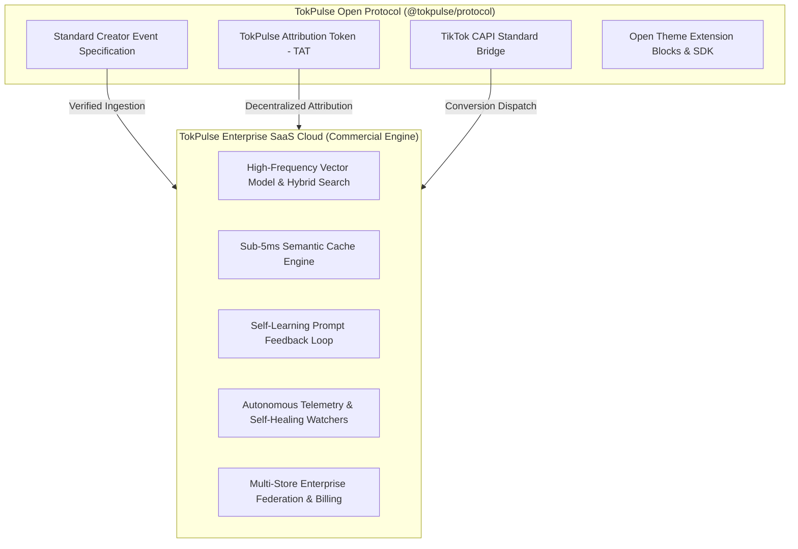

# TokPulse Open Creator-Commerce Protocol (TCP) Specification

Version: `1.0.0`  
Status: `Active Standard`  
License: `MIT (Open Specification & SDKs)`

---

## 1. Executive Overview & Architecture Boundary

The **TokPulse Creator-Commerce Protocol (TCP)** is an open, vendor-neutral standard designed to unify creator attribution, shoppable social media event telemetry, and multi-platform conversions (TikTok Shop, Instagram Shop, Headless Shopify, and Theme App Extensions).



### IP & Commercial Boundary ("Open Core" Strategy)

To ensure this repository is both **shareable as an open protocol ecosystem** and **protects proprietary SaaS enterprise trade secrets**, the codebase is split into two distinct tiers:

1. **Open Standard & Client SDKs (`@tokpulse/protocol`, `packages/theme-ext`, `@tokpulse/sdk`)**:
   - Freely distributable under the **MIT License**.
   - Standard event schemas (`CreatorEventSchema`, `AttributionTokenSchema`).
   - Client-side embed scripts and Liquid Theme App Extension blocks.
   - Allows creators, agencies, and merchants to build custom storefront integrations without vendor lock-in.

2. **Proprietary Enterprise SaaS Engine (`ai/`, `packages/telemetry`, `packages/billing`, `packages/db`)**:
   - Commercial SaaS licensing.
   - Proprietary **Viral Propensity Index (VPI)** neural scoring algorithms.
   - **Semantic Caching & RLAIF Adaptive Prompt Tuning** reducing LLM token overhead by 80%.
   - **Multi-Tenant Federation & Real-time Auto-Scaling Watchers**.

---

## 2. Protocol Specifications

### 2.1 TokPulse Attribution Token (TAT)

The TokPulse Attribution Token is a lightweight, tamper-resistant payload attached to creator referral links and short-form video bio links.

```typescript
interface AttributionToken {
  v: 1; // Protocol version
  c_id: string; // Unique Creator Identifier
  cmp_id?: string; // Campaign ID
  sh_dom: string; // Target Shopify Domain
  iat: number; // Issued at (Unix timestamp)
  exp: number; // Expiration timestamp (Unix)
  sig: string; // HMAC-SHA256 signature
  meta?: Record<string, string>;
}
```

### 2.2 Standard Creator Event Lifecycle

Events are emitted synchronously by edge workers or storefront pixels and queued for server-side verification:

```typescript
type CreatorEventType =
  | 'tokpulse.creator.view'
  | 'tokpulse.creator.click'
  | 'tokpulse.creator.cart_add'
  | 'tokpulse.creator.checkout_initiate'
  | 'tokpulse.creator.purchase'
  | 'tokpulse.creator.lead'
  | 'tokpulse.creator.custom';
```

---

## 3. TikTok Conversions API (CAPI) Integration

TokPulse bridges client-side pixel events with server-side CAPI dispatches, ensuring 100% data fidelity even under aggressive browser cookie restrictions:

```typescript
import { TikTokCapiPayloadSchema } from '@tokpulse/protocol';

// Verify and normalize server-side payload
const payload = TikTokCapiPayloadSchema.parse({
  pixel_code: process.env.TIKTOK_PIXEL_ID,
  event: 'CompletePayment',
  event_id: 'evt_89f023a1',
  timestamp: new Date().toISOString(),
  context: {
    page: { url: 'https://store.tokpulse.com/products/viral-item' },
    user: { email: hashedCustomerEmail },
  },
  properties: {
    currency: 'USD',
    value: 49.99,
    contents: [{ content_id: 'prod_123', quantity: 1, price: 49.99 }],
  },
});
```

---

## 4. Enterprise Compliance & Zero-Trust Verification

- **Timing-Safe Cryptographic Signature Verification** for all incoming webhooks.
- **Automated PII Masking** compliant with GDPR, CCPA, and TikTok Developer Data Policies.
- **Decentralized Attribution** without third-party cookie dependencies.

© 2026 TokPulse Protocol Working Group.
