# TokPulse — Enterprise Creator-Commerce Operating System

<!-- BEGIN: REPO HERO -->

<!-- END: REPO HERO -->

[](https://www.typescriptlang.org/)
[](https://turbo.build/)
[](docs/AI_COMPLIANCE.md)
[](PROTOCOL.md)
[](LICENSE)

**TokPulse** is the next-generation, enterprise multi-store creator-commerce operating system bridging **Shopify Online Store 2.0 / Hydrogen Headless** storefronts with **TikTok Shop, Social Creators, and Server-Side Attribution Telemetry**.

---

## ⚡ Key Differentiators & Bleeding-Edge Capabilities

```mermaid
graph LR
    subgraph Creators ["Social Creators & TikTok"]
        TT[TikTok Shop]
        CP[Creator Affiliate Portal]
        CAP[AI CapCut Script & Veo Engine]
    end

    subgraph TokPulseCloud ["TokPulse Enterprise SaaS Engine"]
        VEC[Self-Learning Vector Engine]
        SEM[Semantic Cache & VPI Model]
        TELE[Autonomous Self-Healing Telemetry]
        CAPI[TikTok Conversions API Bridge]
    end

    subgraph Storefronts ["Merchant Commerce Surfaces"]
        HYD[Headless Hydrogen / Remix]
        THEME[Shopify Dawn / OS 2.0 Blocks]
        MULTI[Multi-Store Federation Control Plane]
    end

    Creators --> |Attribution & Events| TokPulseCloud
    TokPulseCloud --> |Live Real-Time Sync| Storefronts
```



### 🧠 1. Bleeding-Edge AI Vector Engine & Self-Learning Telemetry

- **Dense Vector Embeddings & Hybrid Search:** Powered by `text-embedding-3` with fallback neural hashing for sub-5ms vector lookups.
- **Semantic Query Caching:** Cosine similarity threshold matching (>0.92) caches expensive LLM prompts, slashing AI token costs by **up to 80%**.
- **RLAIF Self-Learning Feedback Loop:** Automatically ingests live conversion signals (CTR, CVR, viral reach) and tunes prompt generation weights dynamically.
- **Viral Propensity Index (VPI):** Predicts short-form video engagement scores (0–100) and recommends optimal TikTok pacing structures.

### 🎬 2. Creator & Social Commerce Operations

- **AI CapCut Script & Video Prompt Generator:** Turns Shopify catalog metadata into viral TikTok video hooks, shotlists, ASMR descriptions, and cinematic prompts for **Google Veo & OpenAI Sora**.
- **Creator Affiliate Portal (`apps/creator-portal`):** Dedicated mobile-first workspace for influencers and affiliates to generate links, track real-time commissions, and explore high-converting products.
- **Shoppable Social Widgets:** Native Shopify Theme App Extension (`packages/theme-ext`) with zero-downtime TikTok video carousels and hashtag feeds.

### 🛡️ 3. Zero-Trust Security & Multi-Tenant SaaS

- **Strict Tenant Context Scoping:** Mathematical row-level isolation guarantees zero cross-tenant data contamination.
- **Privacy Guard v2:** Deep regex and entropy scanning automatically redacts PII (emails, cards, SSNs, phone numbers, tokens) before vector indexing or logging.
- **Cryptographic Signature Verification:** Timing-safe HMAC-SHA256 authentication for TikTok & Shopify webhook streams.
- **Enterprise SaaS Tier Gating:** Turnkey support for **Free, Starter, Growth, Scale, and Enterprise** subscription tiers with rate limiting and metering.

### 🌐 4. Open-Core Architecture & Shareable Protocol

- **TokPulse Open Protocol (`@tokpulse/protocol`):** An open-source, vendor-neutral standard for Creator Commerce Events (`tokpulse.creator.*`) and TokPulse Attribution Tokens (TAT).
- **Decoupled IP Boundary:** Enables open-source community contributions to SDKs and theme blocks while preserving core enterprise AI, federation, and vector indexing as proprietary SaaS IP. See [PROTOCOL.md](PROTOCOL.md).

---

## 📂 Monorepo Architecture

```
TokPulse/
├── apps/
│   ├── creator-portal/        # Vite + React Creator Affiliate Portal
│   ├── partner-app/           # Shopify Partner OAuth & Admin API
│   ├── web-hydrogen/          # Remix / Hydrogen Headless Storefront
│   └── edge-worker/           # Cloudflare / Vercel Edge Event Router
├── packages/
│   ├── protocol/              # @tokpulse/protocol: Open Creator-Commerce Standard
│   ├── api/                   # Core API Routers & TikTok CAPI Handler
│   ├── jobs/                  # Background Sync & TikTok Shop Jobs
│   ├── telemetry/             # Autonomous Self-Healing Telemetry Orchestrator
│   ├── shared/                # Security Guard v2, Tier Gating, Validation
│   ├── theme-ext/             # Shopify OS 2.0 Shoppable TikTok Blocks
│   └── db/                    # Multi-tenant Prisma Client with WASM engine
├── ai/
│   ├── self_learning_vector_engine.ts # Hybrid Search, Semantic Cache & RLAIF
│   ├── capcut_script_generator.ts     # Viral Script & Video AI Prompt Engine
│   ├── self_diagnose.ts               # Autonomous Diagnostics Agent
│   └── privacy_guard.ts               # GDPR/CCPA PII Redaction Agent
└── docs/                      # Enterprise Architecture & Compliance Guides
```

---

## 🚀 Quick Start

### Prerequisites

- **Node.js**: `v20+`
- **pnpm**: `v8+`
- **PostgreSQL / Supabase** or SQLite for local dev

### 1. Installation

```bash
git clone https://github.com/Hardonian/TokPulse.git
cd TokPulse
pnpm install
```

### 2. Configure Environment

```bash
cp .env.example .env
```

### 3. Initialize Database & Run Quality Checks

```bash
pnpm db:push
pnpm typecheck
```

### 4. Start Local Development

```bash
pnpm dev
```

---

## 🧪 Enterprise Testing & Verification

```bash
pnpm typecheck     # TypeScript strict compilation check
pnpm test          # Unit test suite with Vitest
pnpm e2e           # Playwright end-to-end suite
pnpm futurecheck   # Edge runtime & WASM compatibility verification
pnpm watchers:all  # Autonomous nightly DB, API, and AI integrity checks
```

---

## 📜 Licensing & Open Protocol

- **Open Protocol & SDKs (`packages/protocol`, `packages/theme-ext`)**: Licensed under [MIT](LICENSE).
- **TokPulse Enterprise Cloud & AI Core**: All rights reserved. Commercial SaaS license.

© 2026 Hardonia / TokPulse. All rights reserved.
